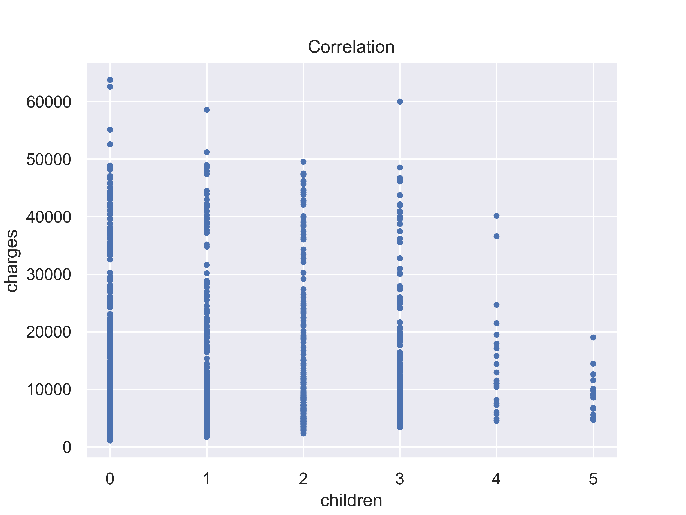

# STAT350 - Final Project Report
### Linear Regression (Ridge and Lasso): Data transform, Variable selection with stepwise (AIC & BIC), Residual Analysis ...
https://www.kaggle.com/mirichoi0218/insurance
# Feature Enginnering
## Part of important features have very obvious linear relationship

## Cluster

## Interaction Term

## Data Transform
Transform region to dummy variable, remove sex, np.sqrt(age) and interaction term: smoker * bmi

# Validation for Linear Regression
+ ## 5-Fold Cross-Validation

| k-Fold  |Before Feature ENSC|After Feature ENSC|
|:--------|:-----------------:|:----------------:|
| 1       |  4239.55240265    | 2807.82126338    |
| 2       |  4260.8069153     | 3084.99942837    |
| 3       |  4015.77345487    | 2670.56856258    |
| 4       |  4256.1702402     | 3099.39012734    |
| 5       |  4216.31183933    | 3186.82664054    |

+ ## Split by Train set and Valid set

|           |Before Feature ENSC |After Feature ENSC  |
|-----------|:------------------:|:------------------:|
|Train Score|  0.741563393009822 | 0.8334705000507185 |
|Train MAE  |  4223.474076767597 | 2967.364883999241  |
|Valid Score|  0.7767193855244048| 0.848931902310171  |
|Valid MAE  |  4013.439299680536 | 2893.789062873719  |

#### >> Although, the score is improved much than before but the it is still not better than boosting algorithm.

# Important Features for LGBM

# Validation for LGBM
+ ## 5-Fold Cross-Validation

| k-Fold  | 1st Run MAE    | 2nd Run MAE   |
|:--------|:--------------:|:-------------:|
| 1       |  2545.43556617 | 2545.43556617 |
| 2       |  2829.55538564 | 2829.55538564 |
| 3       |  2418.90817636 | 2418.90817636 |
| 4       |  2650.78048101 | 2650.78048101 |
| 5       |  2678.52529886 | 2678.52529886 |

+ ## Split by Train set and Valid set

- ### 1st Run

|          |          MAE       |       Score        |
|----------|:------------------:|:------------------:|
| Train    |  2481.129560310218 | 0.8746681435609486 |
| Median-T |  8361.932384328016 |         N/A        |
| Valid    |  2369.6232723162734| 0.8840698783314012 |
| Median-V |  8300.065335343283 |         N/A        |

- ### 2nd Run

|          |          MAE       |       Score        |
|----------|:------------------:|:------------------:|
| Train    |  2455.4715514893255| 0.8779690947700557 |
| Median-T |  8364.460764128615 |         N/A        |
| Valid    |  2446.4441166367365| 0.8739129170755612 |
| Median-V |  8294.447288955223 |         N/A        |
